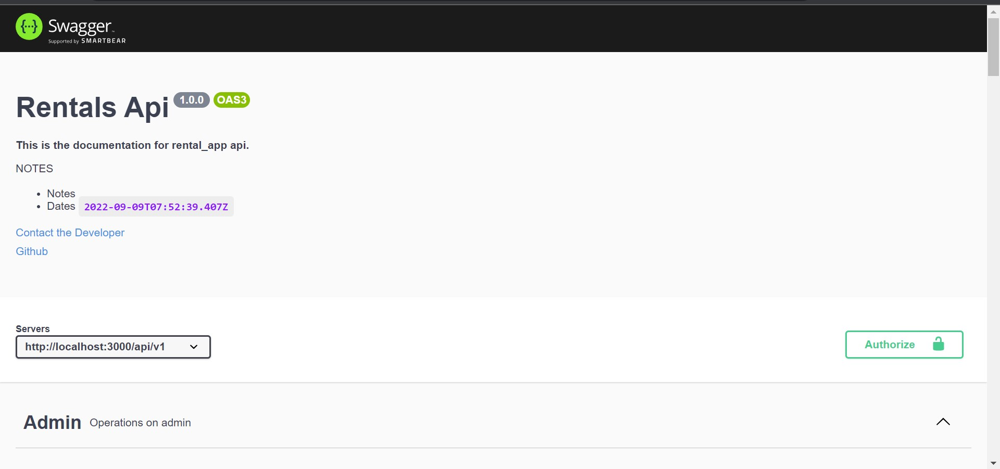

# rentals-backend

Book rentals

# How To Use Swagger For Documentation!

## \*\*\*\*

Swagger can be quite difficult to setup using Node.js,
I have simplified setting up swagger here.

**The swagger file is inside the docs folder**

> Open the docs folder
> Locate the swagger.yml file, other files in the docs folder can be used a reference depending on what you want to achieve
> Edit the swagger.yml file based on the seperate routes you have
> Check the app.js file to see how the swagger.yml file is being loaded, for this app it's loaded as http://baseurl:port/reference/ e.g http://localhost:3000/reference/ , you can tweak this to your taste.

**See Sample Images**
Swagger Image: 
Swagger Image: 
Swagger Image: 
